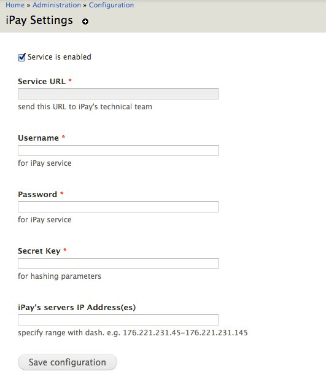

iPay
==========

iPay is Drupal7 module for Bank of Georgia's iPay service integration into your Drupal site.

Requirements
==========

iPay is 100% standalone module. It requires no other modules.

Installation
=============

- Download and extract your module in your sites/all/modules/bog_ipay folder.

- Enable it through the administration area (admin/modules) or through drush (drush -y pm-enable bog_ipay).


Usage
==========

Navigate to /admin/config/ipay/settings, you will see following settings page for iPay module


"Service URL" field will be automatically generated for you.
Please fill other required fields and save the settings.

Module provides full integration with BOG's iPay service. It fires standard drupal hooks for every event (requests from iPay servers) and ANY module is able to hook into that events and implement their custom logic.


Constants
==========


```php
define('iPAY_STATUS_CODE_OK', 0);
define('iPAY_STATUS_CODE_ACCESS_DENIED', 1);
define('iPAY_STATUS_CODE_CREDENTIALS_ARE_INCORRECT', 2);
define('iPAY_STATUS_CODE_HASH_IS_INCORRECT', 3);
define('iPAY_STATUS_CODE_REQUIRED_PARAMETER_IS_MISSING', 4);
define('iPAY_STATUS_CODE_PARAMETER_VALUE_IS_MISSING', 5);
define('iPAY_STATUS_CODE_USER_WASNT_FOUND', 6);
define('iPAY_STATUS_CODE_USER_AMOUNT_IS_INCORRECT', 7);
define('iPAY_STATUS_CODE_PAYMENT_ID_ISNOT_UNIQUE', 8);
define('iPAY_STATUS_CODE_PAYMENT_IS_IMPOSSIBLE', 9);
define('iPAY_STATUS_CODE_SERVICE_DOESNT_EXIST', 10);
define('iPAY_STATUS_CODE_PAYMENT_WAS_SUCCESSFULL_THOUGH_PAYMENT_ID_WASNT_UNIQUE', 18);
define('iPAY_STATUS_CODE_OVERALL_ERROR', 99);
```


Hooks
==========

```php
function hook_ipay_debt($params)
```
<strong>Parameters:</strong>
$params - an Array of parameters passed from iPay server. e.g. 'OP' => 'debt', 'USERNAME' => 'someuser' etc.

<strong>Return value:</strong>
According to iPay's specification of debt request, this hook must return an array of following structure:
```php
array(
  'debt' => $debt_value_according_to_ipay_requirements,
  'info' => array(
    'someparam' => 'somevalue',
    'someparam1' => 'somevalue1'
  ),
);
```

```php
function hook_ipay_verify($params)
```
<strong>Parameters:</strong>
$params - an Array of parameters passed from iPay server. e.g. 'OP' => 'debt', 'USERNAME' => 'someuser' etc.

<strong>Return value:</strong>
Hook must return TRUE, if passed values verified fine. Otherwise, it should return an array of following structure:
```php
array(
  'status_code'    => one_of_defined_status_codes,
  'status_message' => 'custom_status_message'
);
```

```php
function hook_ipay_pay($params)
```
<strong>Parameters:</strong>
$params - an Array of parameters passed from iPay server. e.g. 'OP' => 'debt', 'USERNAME' => 'someuser' etc.

<strong>Return value:</strong>
If payment is successfull, hook must return unique receipt_id, otherwise it should return an array of following 
structure:
```php
array(
  'status_code'    => one_of_defined_status_codes,
  'status_message' => 'custom_status_message'
);
```

Author/maintainer
===================

Original Author and Maintainer:

Giorgi Jibladze
http://github.com/jibla
